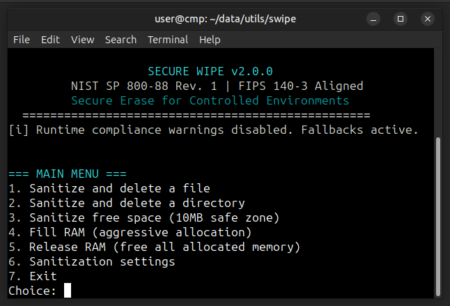

# Secure Wipe (swipe)

[](LICENSE)
[]()
[]()
[]()
[]()

**Secure Wipe** is the command-line counterpart to **Virtual Wipe Turbo**. It is a robust, interactive data sanitization utility designed for secure environments, aligning with **NIST SP 800-88 Rev. 1** and **FIPS 140-3** standards to ensure sensitive data is irrecoverably destroyed.

---

## 📸 Screenshot

<div align="center">
  
  <br/>
  <em>Interactive command-line menu for file, directory, free space, and RAM sanitization</em>
</div>

---

## ✨ Features

- **File Sanitization**: Securely overwrites and deletes individual files.
- **Recursive Directory Wipe**: Sanitizes entire directory trees before removal.
- **Free Space Sanitization**: Clears unused disk space to prevent recovery of previously deleted files.
- **RAM Sanitization**: Aggressively allocates and fills RAM to clear sensitive data from volatile memory.
- **Compliance Aligned**: Supports multiple sanitization schemes based on international standards.
- **TRIM Support**: Integrated SSD TRIM utilities for modern storage media.
- **Interactive Menu**: User-friendly text-based interface for all operations.

---

## 📋 Prerequisites

To build and run Secure Wipe, you need a Linux-based operating system with the following installed:

- **GCC**: The GNU Compiler Collection (`gcc`).
- **Make**: Standard build automation tool.
- **Pthreads**: POSIX threads library (usually included with `libc`).
- **Standard C Library**: Headers for `stdio.h`, `stdlib.h`, `unistd.h`, etc.

### Optional Development Tools
- **Cppcheck**: For static analysis (`make lint`).
- **Clang-Format**: For code style enforcement (`make format`).

---

## 🏗️ Installation

1. **Clone the repository** (or navigate to the source directory):
   ```bash
   cd ~/data/utils/swipe
   ```

2. **Build the executable**:
   ```bash
   make
   ```
   This will generate the `swipe` binary in the current directory.

3. **Install to system** (Optional):
   ```bash
   sudo make install
   ```
   This moves the binary to `/usr/local/bin/swipe` for global access.

---

## 🚀 Usage

Run the program by executing:

```bash
./swipe
```

Once started, you will be presented with an interactive menu:

1. **Sanitize and delete a file**: Enter the full path to a file you wish to destroy.
2. **Sanitize and delete a directory**: Recursively wipes all files and subdirectories.
3. **Sanitize free space**: Wipes the unused portions of a disk/mount point.
4. **Fill RAM**: Fills available memory with patterns to clear data remnants.
5. **Release RAM**: Frees all memory allocated by the tool.
6. **Sanitization settings**: Change between different overwriting schemes (e.g., NIST, Gutmann, etc.).
7. **Exit**: Securely shuts down the tool.

### Available Sanitization Schemes

| Scheme | Description |
|--------|-------------|
| **NIST Clear** | Single-pass zero fill (maximum speed) |
| **DoD 5220.22-M** | Classic 3-pass overwrite |
| **NIST Purge** | 4-pass high-security scheme with verification |
| **Gutmann** | 35-pass scheme for legacy magnetic media |
| **FIPS High-Entropy** | Multi-pass using cryptographically random patterns |

---

## 🛠️ Build Targets

The `Makefile` supports several targets for convenience:

- `make all`: Default build.
- `make clean`: Removes object files and the executable.
- `make debug`: Builds with debug symbols enabled.
- `make lint`: Performs static analysis using `cppcheck`.
- `make format`: Formats code using `clang-format`.
- `make test`: Runs a basic functionality test on a dummy file.

---

## ⚖️ Forensic Considerations

On Copy-on-Write filesystems (Btrfs, ZFS, APFS), traditional file-level wiping can be ineffective due to snapshotting and delayed allocation. In such cases, **Free Space Wipe** is strongly recommended to ensure complete data destruction.

---

## 🔐 Security Note

This tool is designed for high-security environments. Use with caution as data destroyed by this program is **NOT** recoverable. Always ensure you have backups of important data before performing sanitization operations.

---

## 📄 License

This project is released under the **MIT License**.

Copyright © 2026 Jean-François Lachance-Caumartin. All rights reserved.

---

*🦑 Part of the Krakken Cryptographic Ecosystem — Command-Line Edition*
```
